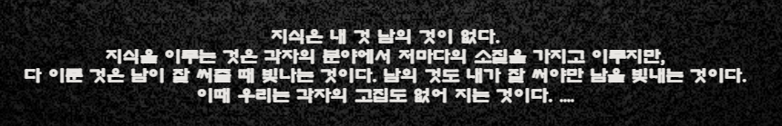

# 🖥️ ㅁ자의 GitHub 연구실 - by-redhat
<br><br>

> [!CAUTION]
> 이곳은 ㅁ자의 소소한 개발 테스트와 개인 설정 연구실입니다.  
> GitHub 프로필 관련 설정 파일과 관리 체크리스트, Markdown 정리 문서를 보관합니다.
   
<br><br>
### 주요정보 링크

[](https://github.com/cib000/by-redhat)[](https://cib000.github.io/by-redhat/)

<br><br>
   

[![EZFav][logo]][EZFav]

[logo]: ./imgs/ezfav_logo.gif
[EZFav]:  https://cib000.github.io/by-redhat  "click to visit 이지즐찾
         

<br><br>
   
> [!TIP]
> 접고 펼치는 기능 추가
   
<details>
<summary>박스 스타일 정보</summary>   
<br><br>     
박스 스타일 정보   
테마 스타일 타입은 src/themes/BoxStyleType.ts에 정의되어있습니다.   
<br><br>   
제목	요청 타입   
티스토리 스타일	TISTORY   
브런치 스타일	BRUNCH   
인스타그램 스타일	INSTA   
링크드인 스타일	LIINKED   
기본 스타일	DEFAULT   
   
tistory brunch insta liinked default    
   
   
```
왼쪽 화살표 : &larr;, &leftarrow;   
오른쪽 화살표 : &rarr;, &rightarrow;   
위 화살표 : &uarr; , &uparrow;   
아래 화살표 : &darr;, &downarrow;   
```
&larr;, &leftarrow;, &rarr;, &rightarrow;, &uarr; , &uparrow;, &darr;, &downarrow;   
   
   
수평선 (구분선)   
```
--- (하이픈 3개)   
*** (별표 3개)   
___ (언더바 3개)   
```
---
***
___

```
<u>이 텍스트는 밑줄이 됩니다.</u>   
~~이 텍스트는 취소선이 됩니다.~~   
```
<u>이 텍스트는 밑줄이 됩니다.</u>   
~~이 텍스트는 취소선이 됩니다.~~   


```
[![the google logo][logo]][google]

[logo]: http://www.google.com/images/logo.gif
[google]: http://www.google.com/ "click to visit Google.com"
```

[![the google logo][logo]][google]

[logo]: http://www.google.com/images/logo.gif
[google]: http://www.google.com/ "click to visit Google.com"

   
> [!NOTE]  
> 사용자가 훑어볼 때에도 고려해야 할 정보를 강조 표시합니다.
   
> [!TIP]
> 사용자의 성공을 돕기 위한 선택적 정보입니다.
   
> [!IMPORTANT]  
> 사용자의 성공에 필수적인 핵심 정보입니다.
   
> [!WARNING]  
> 잠재적 위험으로 인해 사용자의 즉각적인 주의가 필요한 중요 콘텐츠입니다.
   
> [!CAUTION]
> 어떤 행동이 가져올 수 있는 부정적인 잠재적 결과.

> [!QUESTION] Consider this…
> How do we invalidate the cache?

> [!MOTE]  
> 사용자가 훑어볼 때에도 고려해야 할 정보를 강조 표시합니다.
   
> [!TIP]
> 사용자의 성공을 돕기 위한 선택적 정보입니다.

 
   
   
</details>   

---

<br><br>    
## 📁 저장소 구성

| 파일명 | 설명 |
|--------|------|
| `README.md` | 저장소 소개 및 목적 설명 |
| `관리 체크리스트.md` | GitHub/Markdown/관리용 체크리스트 |
| `읽어보기 - 관리.md` | 추가 참고용 정리 문서 |
| `images/` | 문서용 이미지 저장 폴더 |

---

> [!NOTE]  
> 사용자가 훑어볼 때에도 고려해야 할 정보를 표시합니다.
   
     

<br><br>    
# 구분 항목의 소제
   
| 구 분 | 설명 |
| :--------: |------|
| 'docs` | 이지즐찾 메인 홈. |
| 강릉키오스크 | 키오스크에 대한 개발을 시작 준비중..|
| 오토잇 | 컴파일된 자작품. - 공개 / 비공개 |
| 오토잇 예제모음 | 공개 가능한 아이디어 코딩 스크립트. |
| 좋은 글 | 웹서핑 쪼는 자작 글 모음 |
| 후기 정리 | 앱 또는 보안 관련 해킹관련한 분석 정보 모음.. |
| 추가적인 부분이 존재함| 이후로 추가될 부분들이 있음... |
   
   
---

<br><br>   
이곳은 ㅁ자의 소소한 개발 테스트 연구실입니다.   
최고일 수 없고, 최선일 수 없습니다.   
인증서를 포함하지 않으며, 예외처리는 필수입니다.   
   
---
   
<br><br>   
# 필수 사항
   
   
   
## 반드시 인지하고 숙지하신 후 접근하시기 바람니다.   
    
    
    
## 1. 기본 기준 원칙
    
- 일체의 펌을 당분간 금지합니다.    
- 자작에 대해서는 권한 이양이 없습니다. ( 일정시간 : 격*님 예외 - 지속 유지)   


<br><br><br>
## 2. 개인의 공간임을 반드시 인지    
    
- 개인의 사념및 개발에 대한 소일이므로 이를 반드시 인지하십시요.    
    
    
<br><br><br>
## 3. 원문 무훼손의 원칙과 정보자료 취급 5계율
    
- 타인의 작품 또는 지역화에서 이름만 바꿔치기 등의 몰상식한 행위는 하지 않는다.    
- 타인의 작품을 모조리 까발리는 행위를 하지 않는다.    
- 의뢰받은 건에 대한 비밀의 엄수는 목숨처럼 여긴다.    
- 좋을때도 심지어 원수가 되더라도 비밀엄수는 목숨처럼 여기도록 한다.        
- 어떠한 경우라도 원칙과 기준은 반드시 엄수하여야 한다.    
    
---
    
    
<details>
<summary>박스 스타일 정보</summary>       
- [ ] `- [ ]`를 입력하고 한 칸 띄어쓰기 하고 내용을 적습니다. 
- [X] 표시를 하면 프리뷰 모드에서 체크가 된 것으로 보여집니다
</details>
    
- [x] 깃허브 활성화 및 개방 & 보호 구분 운용화      
   
- [ ] 마크타운의 정리 추가 갱신 : 진행중   
- [ ] 아이디어 정리 : 진행중
     
- [ ] 동안의 발자국을 하나씩 정리    
- [ ] 함수별 모듈화 및 UDF  
    

<details>
<summary>체크박스 스타일 정보</summary>       
```
- [ ] 아메리카노
- [x] 카페라떼
- [ ] 카푸치노
- [ ]
```
</details>

---
   
> [!NOTE]
> > 지식이라는 것은........
         
   

[![the google1 logo1][logo1]][google1]

[logo1]: ./imgs/profile_1.svg
[google1]: https://translate.google.co.kr/?hl=ko&tab=TT&sl=auto&tl=ko&op=translate "click to visit 구글번역"

[![the google1 logo2][logo2]][google2]

[logo2]: ./imgs/profile_2.svg
[google2]: https://translate.google.co.kr/?hl=ko&tab=TT&sl=auto&tl=ko&op=translate "click to visit 구글번역"
      
      
---
   
   
   
   
    
<details>
<summary>WAI</summary>
   
<!-- summary 아래 한칸 공백 두어야함 -->
## Who am i ?
>Infodata pw is    
by-redhat
</details>
   
   
<details>
<summary> 도움  </summary>   

   
> [!WARNING] 
>    ????????????????
     
> [!TIP]
> 팁
    
     

> [!NOTE]  
> 사용자가 훑어볼 때에도 고려해야 할 정보를 강조 표시합니다.

> [!TIP]
> 사용자의 성공을 돕기 위한 선택적 정보입니다.

> [!IMPORTANT]  
> 사용자의 성공에 필수적인 핵심 정보입니다.

> [!WARNING] 
> 잠재적 위험으로 인해 사용자의 즉각적인 주의가 필요한 중요 콘텐츠입니다.

> [!CAUTION]
> 어떤 행동이 가져올 수 있는 부정적인 잠재적 결과.

   

   
</details>


> [!WARNING] 
>    ????????????????
     
> [!TIP]
> 팁
    
     

> [!NOTE]  
> 사용자가 훑어볼 때에도 고려해야 할 정보를 강조 표시합니다.

> [!TIP]
> 사용자의 성공을 돕기 위한 선택적 정보입니다.

> [!IMPORTANT]  
> 사용자의 성공에 필수적인 핵심 정보입니다.

> [!WARNING] 
> 잠재적 위험으로 인해 사용자의 즉각적인 주의가 필요한 중요 콘텐츠입니다.

> [!CAUTION]
> 어떤 행동이 가져올 수 있는 부정적인 잠재적 결과.
    
              
[](https://github.com/cib000/by-redhat)
[](https://cib000.github.io/by-redhat/)
   
[](https://cib000.github.io/by-redhat/)
[](https://cib000.github.io/by-redhat/)
    
    
