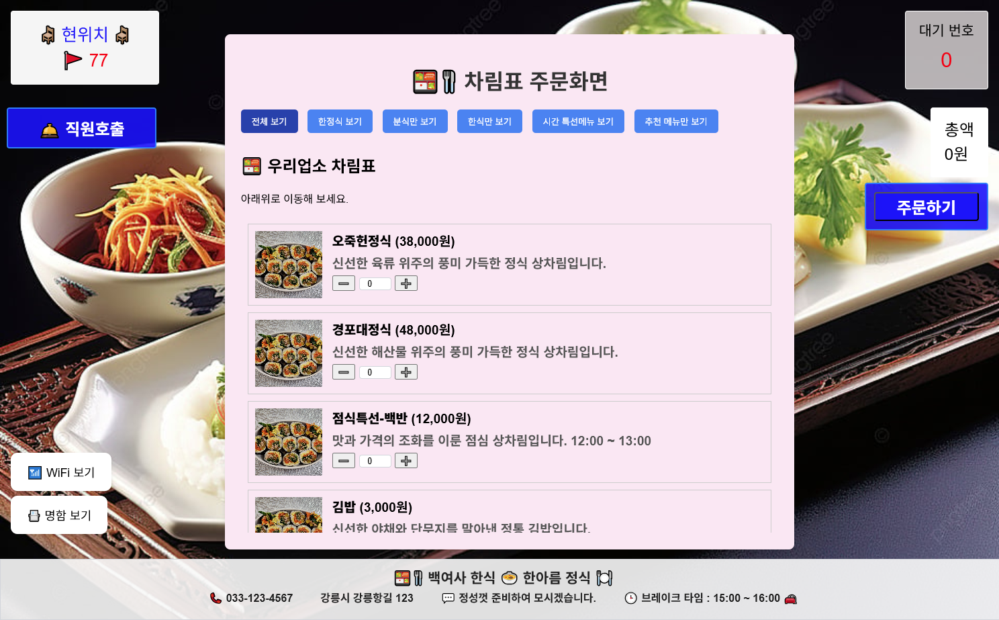
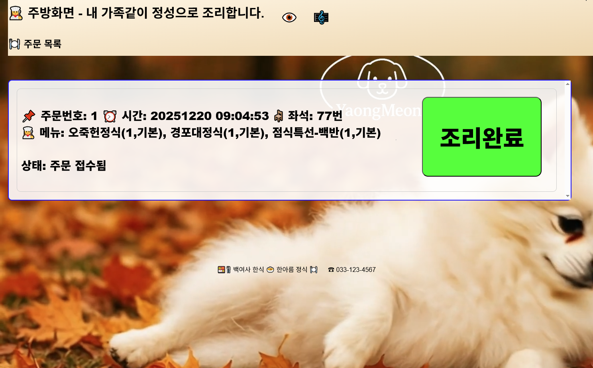
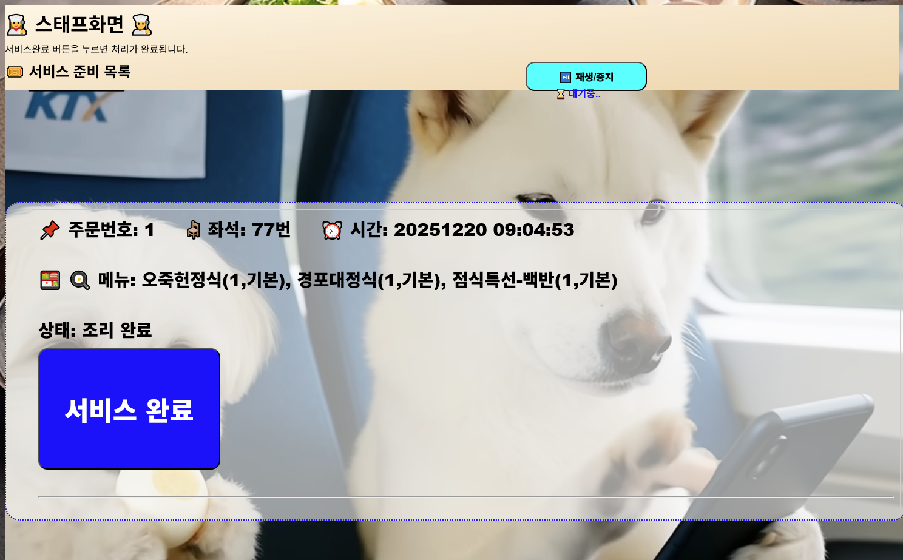
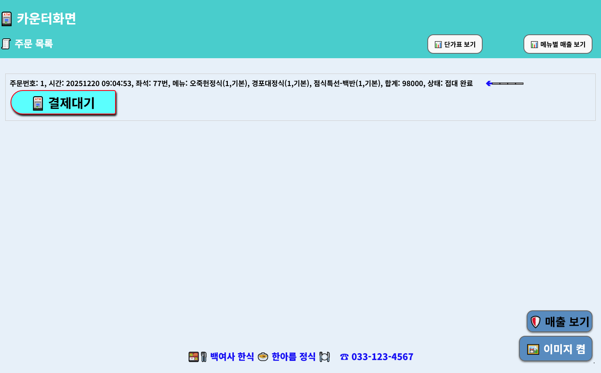
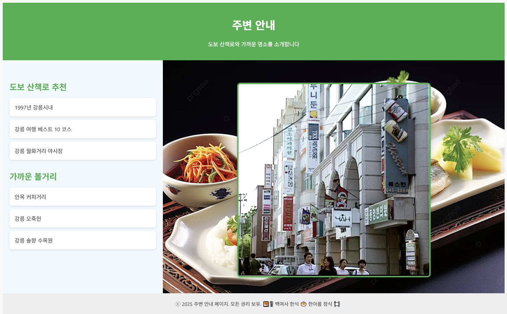
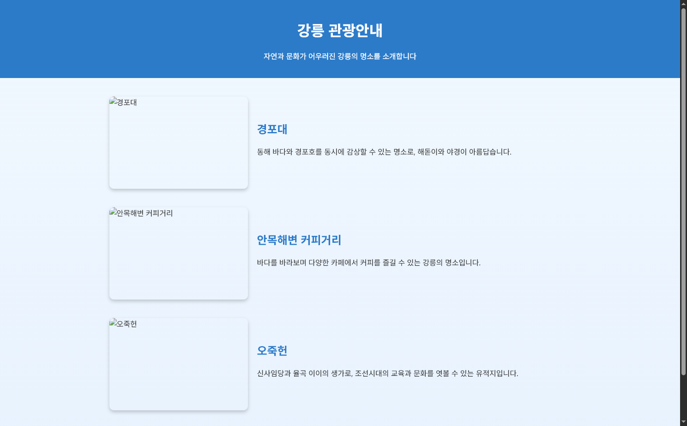

# 강릉키오스크 프로젝트

## 목적과 범위
- 소규모 영세 상공인을 위한 키오스크의 연구 개발

-- 남는 또는 저가의 태블릿 또는 노트북을 활용한 광고및 초간단 키오스크의 구현

- 범위

-- 화면 표시및 간략 집게까지만

   ㄴ 인쇄기능은 옵션처리부로 

   
   
# 현재는 비공개처리함

---
   
# 스크린샷

## 강릉키오스크 - 메인

---
   
강릉키오스크 - 안내 #2.png

강릉키오스크 - 안내 #1.png

강릉키오스크 - 카운터.png

강릉키오스크 - 스태프.png

강릉키오스크 - 주방.png

강릉키오스크 - 주문.png

강릉키오스크 - 메인.png

